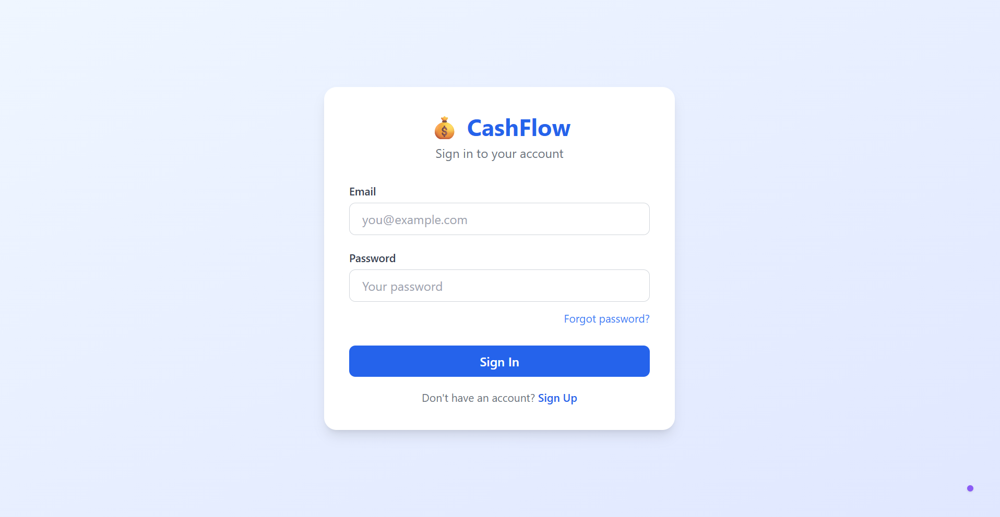
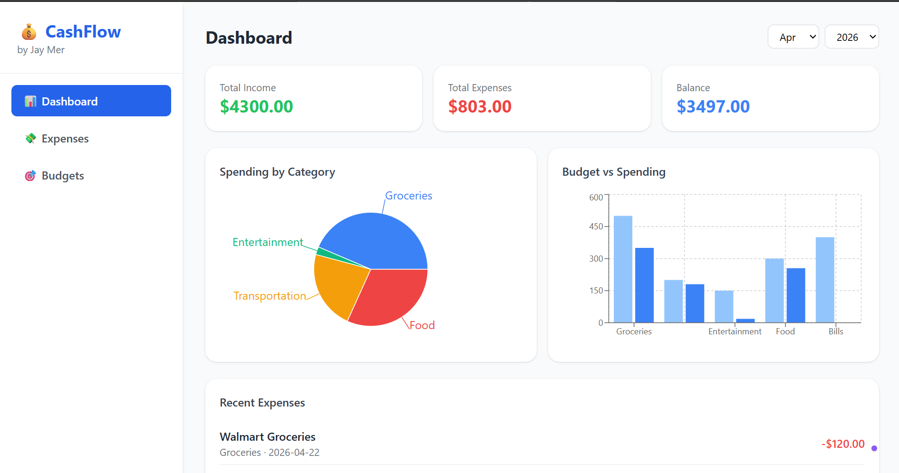
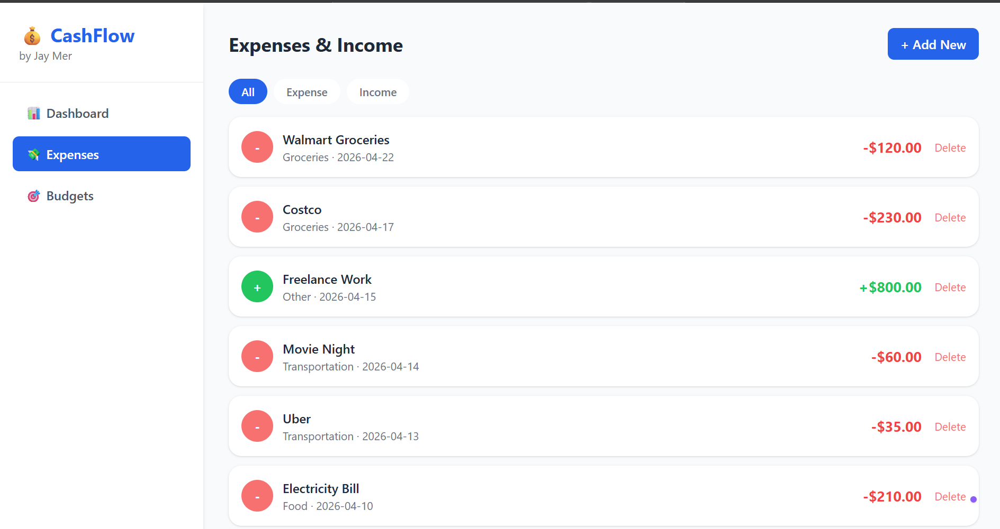
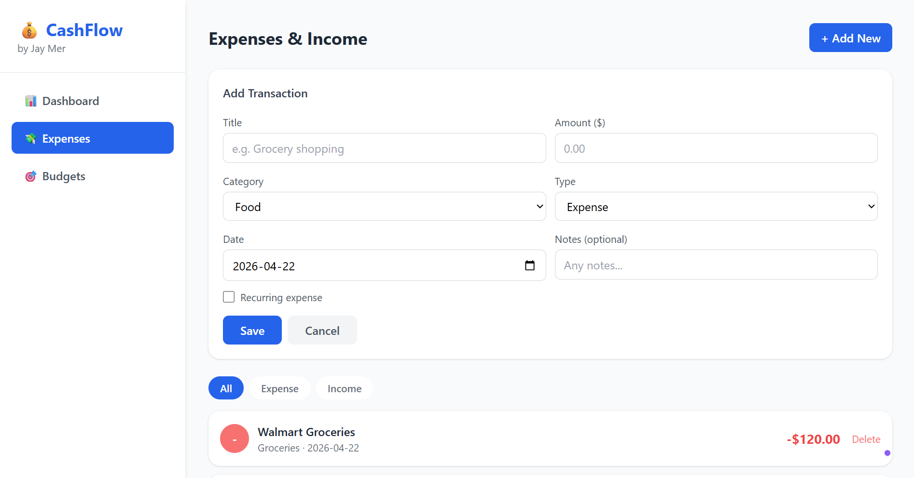
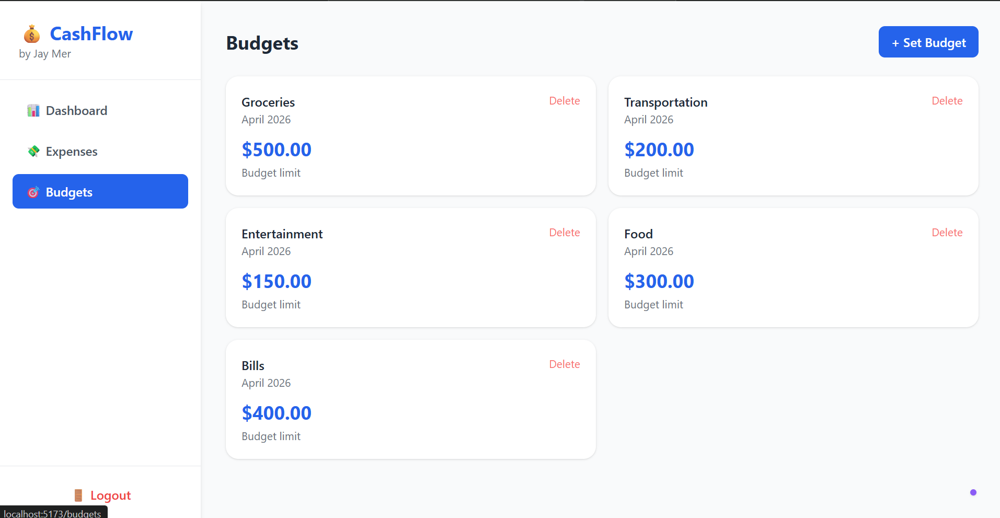
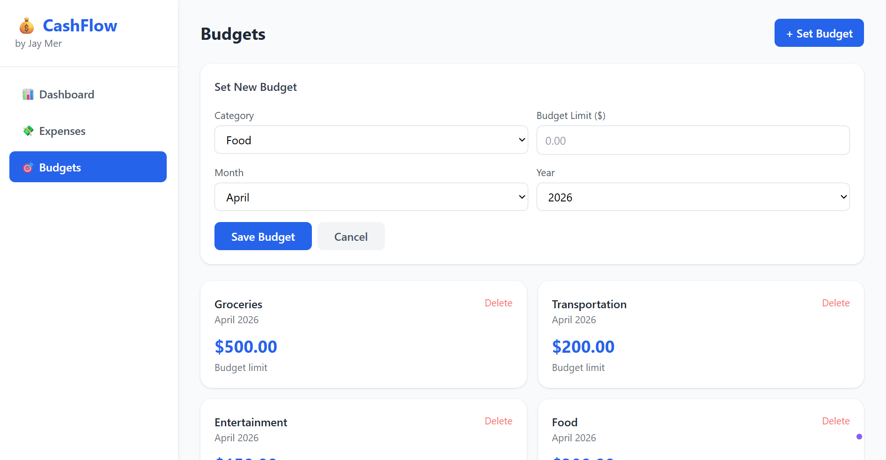

# 💰 CashFlow - Personal Finance Tracker

A full-stack personal finance web application built with FastAPI, React, and PostgreSQL.

## ✨ Features
- 🔐 User authentication (Register, Login, Forgot Password)
- 💸 Track expenses and income with categories
- 🎯 Set monthly budgets per category
- 📊 Dashboard with spending analytics and charts
- 🔄 Mark expenses as recurring
- 📅 Filter by month and year
- 📱 Responsive design

## 📸 Screenshots

### Login


### Dashboard


### Expenses


### Expenses-Form


### Budgets


### Budgets-Form


## 🛠️ Tech Stack
**Backend:**
- Python, FastAPI
- PostgreSQL, SQLAlchemy
- JWT Authentication
- Bcrypt password hashing

**Frontend:**
- React, Vite
- Tailwind CSS
- Recharts (data visualization)
- React Router

## 🚀 Getting Started

### Backend Setup
```bash
cd backend
pip install -r requirements.txt
uvicorn main:app --reload
```

### Frontend Setup
```bash
cd frontend
npm install
npm run dev
```

### Environment Variables
Create a `.env` file in the backend folder:
